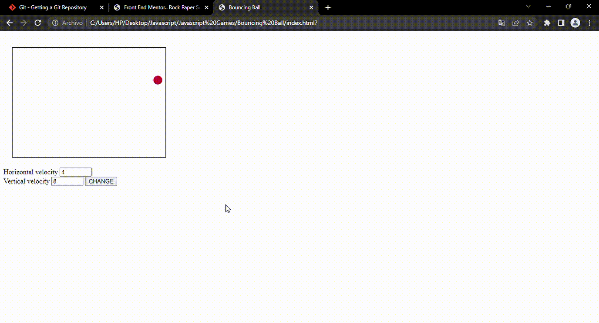

## Bouncing ball animation built with JS

This is a simple animation done by drawing a ball with code and then a set interval function is created to delete the ball and draw it in a new position and when done fast enough it gives the impression of animation of a ball in a box.
